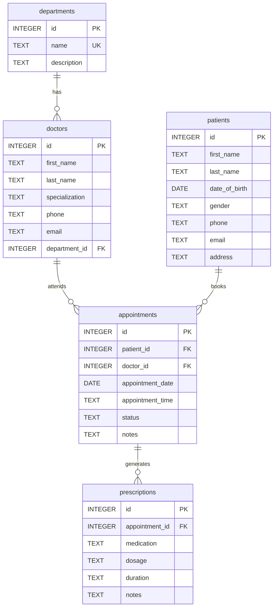

# Clinic Patient Management System — Database Design Document

**Course:** CS 348 | **Database:** SQLite 3 | **Schema File:** `schema.sql`

---

## Entity-Relationship Overview

---

## Table Descriptions

### 1. `departments`

Stores clinic departments. Acts as the top-level organizational unit.

| Column | Type | Constraints |
|---|---|---|
| `id` | INTEGER | PRIMARY KEY AUTOINCREMENT |
| `name` | TEXT | NOT NULL, UNIQUE |
| `description` | TEXT | — |

---

### 2. `doctors`

Stores doctor profiles. Each doctor belongs to exactly one department.

| Column | Type | Constraints |
|---|---|---|
| `id` | INTEGER | PRIMARY KEY AUTOINCREMENT |
| `first_name` | TEXT | NOT NULL |
| `last_name` | TEXT | NOT NULL |
| `specialization` | TEXT | NOT NULL |
| `phone` | TEXT | — |
| `email` | TEXT | — |
| `department_id` | INTEGER | NOT NULL, FK → `departments(id)` ON DELETE CASCADE |

---

### 3. `patients`

Stores patient demographics. Independent of doctors/departments.

| Column | Type | Constraints |
|---|---|---|
| `id` | INTEGER | PRIMARY KEY AUTOINCREMENT |
| `first_name` | TEXT | NOT NULL |
| `last_name` | TEXT | NOT NULL |
| `date_of_birth` | DATE | NOT NULL |
| `gender` | TEXT | NOT NULL, CHECK IN ('Male', 'Female', 'Other') |
| `phone` | TEXT | — |
| `email` | TEXT | — |
| `address` | TEXT | — |

---

### 4. `appointments`

Junction table connecting patients and doctors with scheduling details.

| Column | Type | Constraints |
|---|---|---|
| `id` | INTEGER | PRIMARY KEY AUTOINCREMENT |
| `patient_id` | INTEGER | NOT NULL, FK → `patients(id)` ON DELETE CASCADE |
| `doctor_id` | INTEGER | NOT NULL, FK → `doctors(id)` ON DELETE CASCADE |
| `appointment_date` | DATE | NOT NULL |
| `appointment_time` | TEXT | NOT NULL |
| `status` | TEXT | NOT NULL, DEFAULT 'Scheduled', CHECK IN ('Scheduled', 'Completed', 'Cancelled', 'No Show') |
| `notes` | TEXT | — |

---

### 5. `prescriptions`

Stores medications prescribed during an appointment. Each prescription belongs to exactly one appointment.

| Column | Type | Constraints |
|---|---|---|
| `id` | INTEGER | PRIMARY KEY AUTOINCREMENT |
| `appointment_id` | INTEGER | NOT NULL, FK → `appointments(id)` ON DELETE CASCADE |
| `medication` | TEXT | NOT NULL |
| `dosage` | TEXT | NOT NULL |
| `duration` | TEXT | NOT NULL |
| `notes` | TEXT | — |

---

## Data Integrity Features

### Foreign Keys with Cascading Deletes

All foreign keys use `ON DELETE CASCADE`:

| Parent → Child | Effect of Deleting Parent |
|---|---|
| `departments` → `doctors` | Deleting a department removes all its doctors |
| `patients` → `appointments` | Deleting a patient removes all their appointments |
| `doctors` → `appointments` | Deleting a doctor removes all their appointments |
| `appointments` → `prescriptions` | Deleting an appointment removes all its prescriptions |

SQLite requires `PRAGMA foreign_keys = ON` at every connection to enforce these rules — this is set in the application layer via `database.py`.

### CHECK Constraints

| Table | Column | Allowed Values |
|---|---|---|
| `patients` | `gender` | 'Male', 'Female', 'Other' |
| `appointments` | `status` | 'Scheduled', 'Completed', 'Cancelled', 'No Show' |

These prevent invalid data from being inserted at the database level.

---

## Normalization

The schema is in **Third Normal Form (3NF)**:

- **1NF:** All columns contain atomic values; no repeating groups.
- **2NF:** Every non-key column depends on the entire primary key (single-column PKs, so 2NF is automatic).
- **3NF:** No transitive dependencies — e.g., department info is stored in `departments`, not duplicated in `doctors`.

---

## Sample Data Summary

The seed data (`seed_data.sql`) populates the database with:

| Table | Records |
|---|---|
| Departments | 6 (Cardiology, Neurology, Orthopedics, Pediatrics, Dermatology, General Medicine) |
| Doctors | 8 |
| Patients | 15 |
| Appointments | 20 (10 completed, 1 cancelled, 9 scheduled) |
| Prescriptions | 10 |
